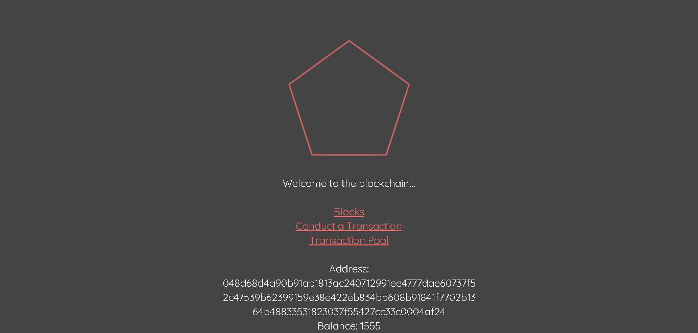
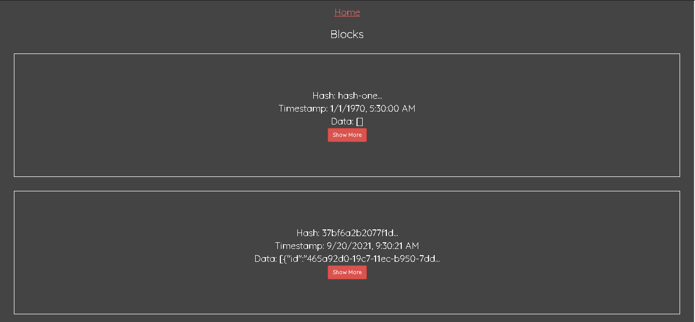
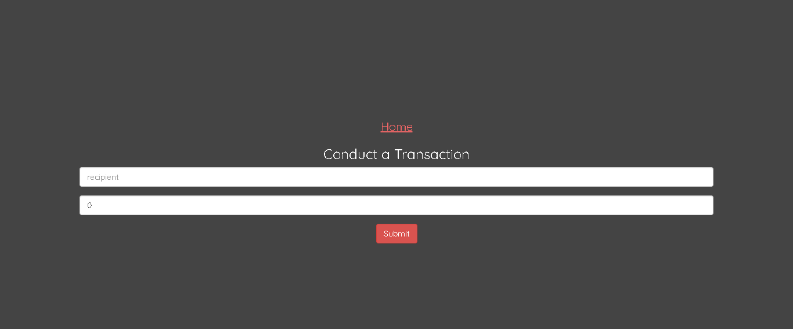
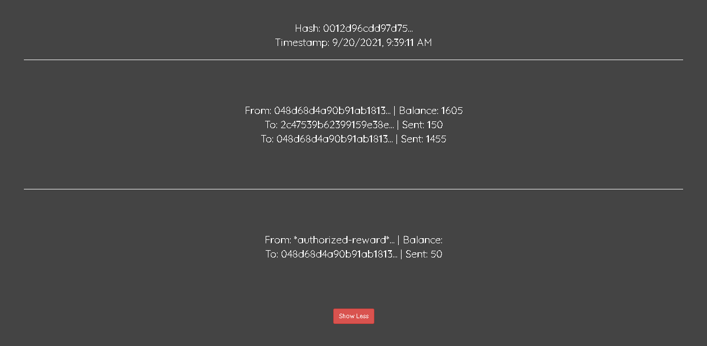
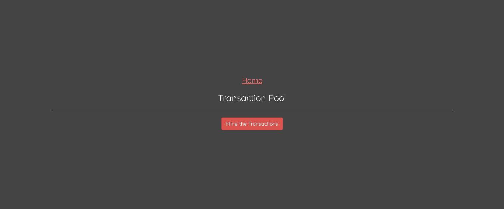
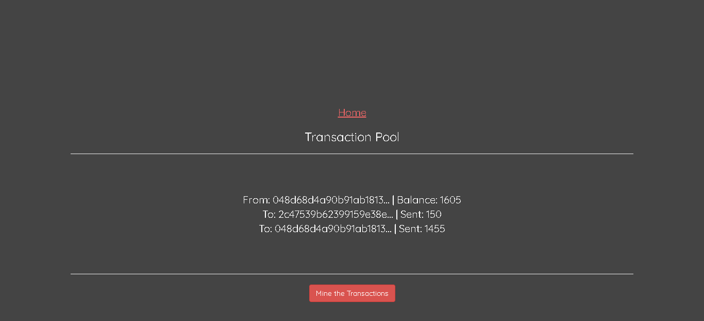

# Cryptocurrency Blockchain

This is  full stack web application depicting the decentralized blockchain network involving a hypothetical cryptocurrency "CryptoChain" coin for transactions. This applications has following features:

- Genesis block for initiation of blockchain
- Mining of blocks
- Transaction pool for unmined blocks
- Details of each block in blockchain
- Blockchain history
- Starting different node peers and connecting them to blockchain

## Libraries Used

- Frontend: `React`
- Backend: `Express.js`
- Testing: `Jest`
- Runtime Environment: `Node.js`
- Database: `Redis`

## Dependencies

- [Node.js](https://nodejs.org/en/). Refer to this [documentation](https://nodejs.org/en/download/package-manager/) for instructions.
- [Redis](https://redis.io/). Refer to this [documentation](https://redis.io/topics/quickstart) for instructions.
- Linux environment or [WSL](https://docs.microsoft.com/en-us/windows/wsl/install-win10) (for windows) for smooth installation on localhost

# Installation

1. Clone the project from Github.

    ```bash
    git clone https://github.com/naveen-ku/cryptochain.git
    ```

2. In the `root directory` type the following command to download dependencies:

    ```bash
    npm install
    ```

3. After this start the project on root node (i.e. PORT 3000) by using following command:

    ```bash
    npm run dev
    ```

4. To start different peers/nodes in the network, enter following command terminal & the server is started on a random PORT which can be noted from the terminal stating `listening on PORT:3XXX`

    ```bash
    npm run dev-peer
    ```

# Snapshots
<p align="center">






</p>